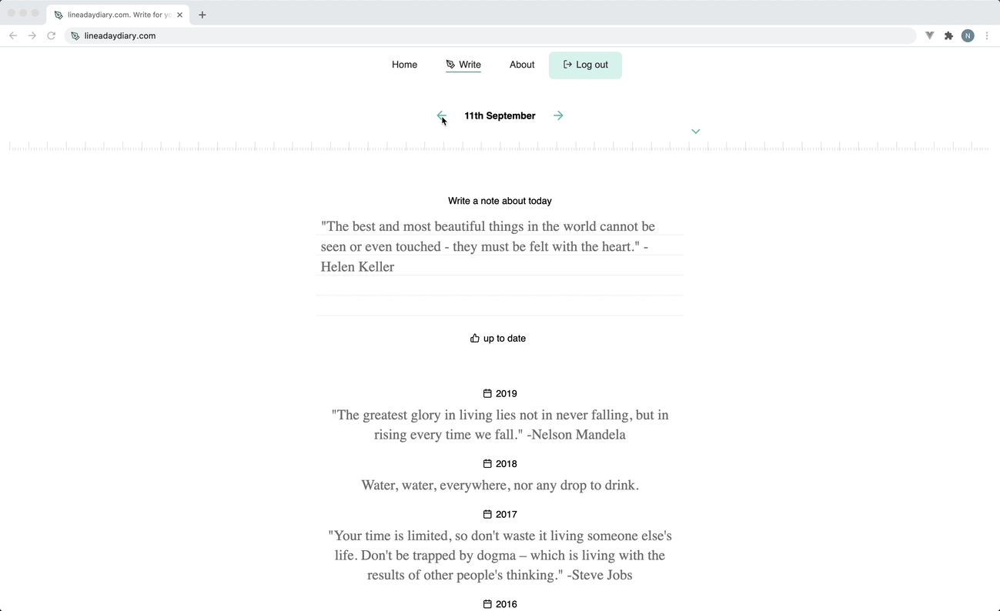

# [LineADayDiary.com](https://lineadaydiary.com)



## 🚀 Quick start

As this is a serverless application there are a couple of services you will need to sign-up for to be able to run a local environment. Both are free for the volume of traffic that you will have in development. You don't even need to provide payment details to sign-up.

### Auth

For auth you need to sign up with Netlify. To do this go to [netlify.com](https://www.netlify.com/), and sign up for a free account, then create a website.

If you've forked this repository then you can get Netlify to create a site using your Git repository, otherwise you can drag a site folder on to Netlify. You don't actually need their hosting, but you do need to create the site so that you can use their Identity service. Once created, click on the Identity tab. This will tell you your Identity API end-point. Copy that (ignoring the `/.netlify/identity` part), and paste it over `https://lineadaydiary.com` in your [Gatsby config](./gatsby-config.js).

```javascript
{
  resolve: 'gatsby-plugin-netlify-identity',
  options: {
    url: 'https://lineadaydiary.com'
  }
}
```

### Database

For the database you need to sign up for a free account with [Fauna](https://fauna.com/). Create a database, then click on the `Security` tab. Create a new Admin key. Copy the secret it gives you, and store it somewhere safe. Then in your terminal enter `FAUNADB_SERVER_SECRET=` followed by your secret.

### Install

Ok so you now have everything set up. Install the dependencies with `npm i`.

### Initialise

To initialise your database run `npm run bootstrap-db`.

### Run the project!

Run your local environment with `npm run develop`.
